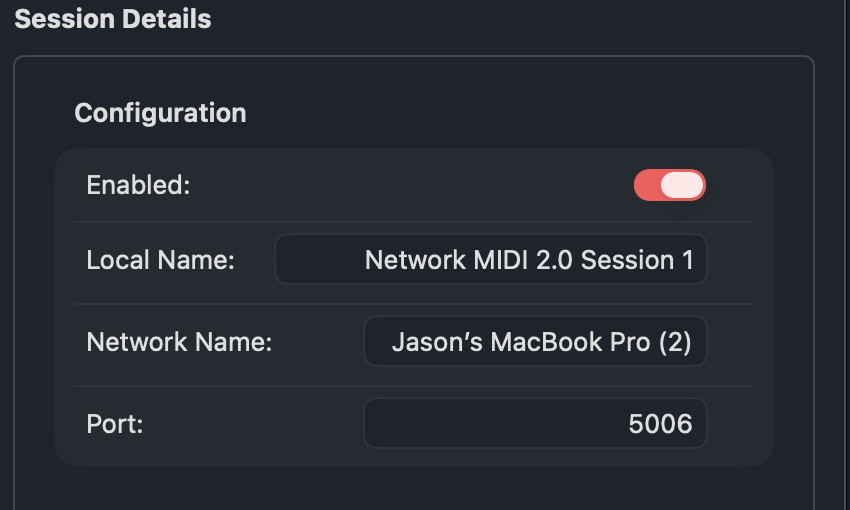
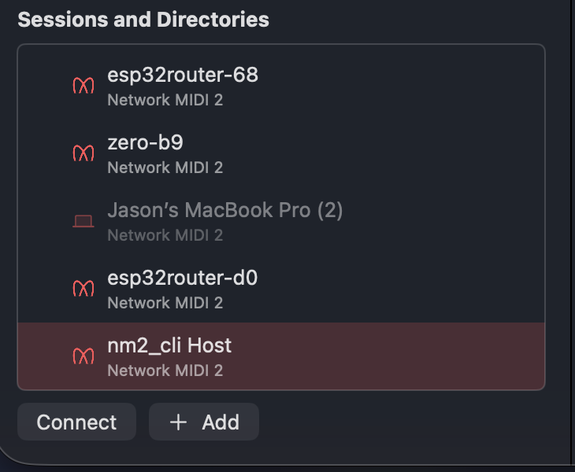
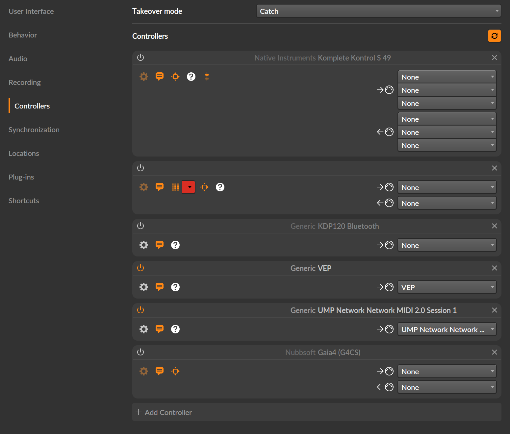

# Getting MIDI 2.0 across a network, and what it takes to do it properly

A practical guide to `libnetmidi2` — implementing Network MIDI 2.0 (UDP) in your own
synth, router, or app.

---

## Part 1: The problem

### MIDI 2.0 is a real upgrade, and most of it dies at the cable

MIDI 1.0 is from 1983 and it shows. Velocity is 7 bits — 128 steps. Control changes
are 7 bits. Pitch bend gets 14 if you use both halves. Everything is one-way: your
controller shouts into the dark and hopes there's a synth listening.

MIDI 2.0 fixes the things that actually hurt:

- **32-bit resolution** on velocity and controllers. Not 128 steps — 4.3 billion.
- **Per-note controllers.** Pitch, timbre and pressure per *note*, not per channel,
  so a chord can bend one note without dragging the others with it.
- **Bidirectional negotiation.** Devices discover each other's capabilities and agree
  on a protocol instead of guessing.
- **Universal MIDI Packets (UMP)** — one 32-bit-word-based container for all of it.

Now you need to get those packets between two machines. USB works, but it's
point-to-point and the cable is three metres long. What you usually want is the
network: a synth in a rack, a controller on a desk, a router on a Pi, all on Wi-Fi or
Ethernet.

And here's where it falls apart. **The obvious network-MIDI option on most platforms
is RTP-MIDI, and RTP-MIDI is MIDI 1.0.** It carries 7-bit messages. Send a 32-bit
MIDI 2.0 velocity through it and it gets squashed to 128 steps somewhere in the
middle, silently. You did all that work for nothing.

### The spec exists. Implementations mostly don't.

The MIDI Association published **M2-124-UM, "Network MIDI 2.0 (UDP)" v1.0** in
November 2024. It's a proper transport: UMP over UDP, session handshake, sequence
numbers, loss recovery, authentication, mDNS discovery.

The catch is adoption:

- **macOS 26 (Tahoe)** ships it — the first mainstream OS to do so. You'll find it in
  *Audio MIDI Setup → MIDI Network Setup*. Turn on a session and it advertises itself
  as `_midi2._udp` on the network.
- **Everything before that, and most things beside it** — Windows, Linux, and every
  bare-metal target — have nothing.

So if you're building a MIDI 2.0 device today, you implement the spec yourself. That's
around fifty pages of command tables, a session state machine, 16-bit sequence
numbers with wraparound, forward error correction, retransmit negotiation, and a
SHA-256 authentication exchange. All of it big-endian, all of it arriving from a
hostile network that can drop, duplicate, reorder, or lie.

That is what this library is for.

### What `libnetmidi2` is, and what it deliberately isn't

**It is** a C++17 implementation of the M2-124-UM transport: framing, the session
state machine, sequence numbers and deduplication, ping/keepalive, graceful teardown,
FEC, retransmit, session reset, and the authentication digests.

**It is not** any of these, on purpose:

| Not included | Why |
|---|---|
| A UDP socket | You have one already, and yours knows about your event loop, your thread model and your platform. |
| A clock | Same. |
| An mDNS responder | Multicast, record encoding and TTL caches are deeply platform-specific. Bonjour, Avahi and a Zephyr responder look nothing alike. |
| SHA-256 | Shipping one implementation would make your hardware crypto accelerator unreachable. |
| A MIDI stack | This moves UMP. What the UMP *means* is your application's business. |

You supply those through four small interfaces. The core never calls the OS, never
allocates, never throws, and has no STL containers — which is why the same code that
runs in a desktop app also compiles for a Teensy under Zephyr.

---

## Part 2: Implementing it

### Step 0: Get it into your build

Header-only. With CMake:

```cmake
add_subdirectory(libnetmidi2)
target_link_libraries(your_app PRIVATE netmidi2)
```

Or put `libnetmidi2/include` on your include path. There's nothing to link.

```cpp
#include <netmidi2/Session.h>
using namespace netmidi2;
```

### Step 1: The socket adapter

`IUdpSocket` is three methods. Two requirements matter more than they look:
**`receive()` must not block**, and **the socket should be dual-stack**.

That second one cost a real afternoon, so it is worth saying plainly before the code.
A macOS host advertises its hostname over mDNS, and `<host>.local` resolves to *both*
address families — with the **IPv6 records listed first**. A peer that dials you by
name will therefore often arrive over IPv6, and an `AF_INET` socket never sees the
Invitation. Not an error, not a rejected packet: nothing at all, while the other end
reports that you did not answer. This was found by pointing macOS Tahoe's own client
at an IPv4-only build of `nm2_cli`; its Invitation was going to
`fe80::1c2d:3e4f:5a6b:7c8d%en0` and landing nowhere.

So: one `AF_INET6` socket with `IPV6_V6ONLY` turned off, which receives both families.

```cpp
#include <netmidi2/Session.h>
#include <arpa/inet.h>
#include <fcntl.h>
#include <netdb.h>
#include <netinet/in.h>
#include <sys/socket.h>
#include <unistd.h>
#include <cstdio>
#include <cstring>

using namespace netmidi2;

struct PosixUdpSocket : IUdpSocket
{
    int fd = -1;

    bool bind (std::uint16_t desiredPort, std::uint16_t& boundPortOut) override
    {
        fd = ::socket (AF_INET6, SOCK_DGRAM, 0);
        if (fd < 0) return false;

        int off = 0;                                       // dual-stack: accept v4 too
        ::setsockopt (fd, IPPROTO_IPV6, IPV6_V6ONLY, &off, sizeof off);
        ::fcntl (fd, F_SETFL, O_NONBLOCK);                 // non-blocking is mandatory

        sockaddr_in6 addr {};
        addr.sin6_family = AF_INET6;
        addr.sin6_addr   = in6addr_any;                    // not loopback: peers are out there
        addr.sin6_port   = htons (desiredPort);            // 0 = let the OS choose
        if (::bind (fd, (sockaddr*) &addr, sizeof addr) != 0) return false;

        // Report the port we actually got: mDNS has to advertise the real number.
        sockaddr_in6 actual {}; socklen_t len = sizeof actual;
        ::getsockname (fd, (sockaddr*) &actual, &len);
        boundPortOut = ntohs (actual.sin6_port);
        return true;
    }

    int send (const Endpoint& to, const std::uint8_t* data, std::size_t len) override
    {
        sockaddr_in6 addr {};
        addr.sin6_family = AF_INET6;
        addr.sin6_port   = htons (to.port);

        if (std::strchr (to.address, ':') == nullptr)
        {
            in_addr v4 {};                                 // IPv4 literal -> ::ffff:a.b.c.d
            if (::inet_pton (AF_INET, to.address, &v4) != 1) return -1;
            addr.sin6_addr.s6_addr[10] = 0xFF;
            addr.sin6_addr.s6_addr[11] = 0xFF;
            std::memcpy (&addr.sin6_addr.s6_addr[12], &v4, 4);
        }
        else
        {
            // getaddrinfo, not inet_pton: only it parses the %scope that a
            // link-local address carries, and link-local is what .local peers give.
            addrinfo hints {};
            hints.ai_family = AF_INET6; hints.ai_socktype = SOCK_DGRAM;
            hints.ai_flags  = AI_NUMERICHOST;
            addrinfo* res = nullptr;
            if (::getaddrinfo (to.address, nullptr, &hints, &res) != 0 || res == nullptr)
                return -1;
            auto* r = (sockaddr_in6*) res->ai_addr;
            addr.sin6_addr     = r->sin6_addr;
            addr.sin6_scope_id = r->sin6_scope_id;
            ::freeaddrinfo (res);
        }

        return (int) ::sendto (fd, data, len, 0, (sockaddr*) &addr, sizeof addr);
    }

    int receive (std::uint8_t* buffer, std::size_t capacity, Endpoint& from) override
    {
        sockaddr_storage ss {}; socklen_t sl = sizeof ss;
        const ssize_t n = ::recvfrom (fd, buffer, capacity, 0, (sockaddr*) &ss, &sl);
        if (n < 0) return 0;               // EWOULDBLOCK -- nothing pending, NOT an error

        auto* a6 = (sockaddr_in6*) &ss;
        if (IN6_IS_ADDR_V4MAPPED (&a6->sin6_addr))
        {
            // Normalise ::ffff:a.b.c.d back to dotted quad. Endpoint identity is a
            // string comparison, so the same peer must always spell the same way.
            in_addr v4 {};
            std::memcpy (&v4, &a6->sin6_addr.s6_addr[12], 4);
            ::inet_ntop (AF_INET, &v4, from.address, sizeof from.address);
        }
        else
        {
            ::inet_ntop (AF_INET6, &a6->sin6_addr, from.address, sizeof from.address);
            if (a6->sin6_scope_id != 0)                    // link-local needs its interface
            {
                char scope[16];
                std::snprintf (scope, sizeof scope, "%%%u", a6->sin6_scope_id);
                if (std::strlen (from.address) + std::strlen (scope) < sizeof from.address)
                    std::strcat (from.address, scope);
            }
        }
        from.port = ntohs (a6->sin6_port);
        return (int) n;
    }
};
```

Four things that will bite you if you skip them:

1. **Dual-stack, as above.** The failure mode is silence, which is the hardest kind to
   debug — you will be looking at your session code when the packet never arrived.
2. **Normalise v4-mapped addresses back to dotted quad.** The library identifies a peer
   by the address *string*, so `203.0.113.5` and `::ffff:203.0.113.5` must not be
   allowed to look like two different devices.
3. **Return `0`, not `-1`, when there is nothing to read.** `-1` means a real error.
   Backwards, and the library concludes the socket is broken.
4. **Report the *actual* bound port.** Pass `0` for an ephemeral port, advertise `0`
   over mDNS, and nobody can reach you.

If you genuinely only ever talk to fixed IPv4 addresses, an `AF_INET` socket is fifteen
lines and works fine. The moment discovery is involved, use the one above.

### Step 2: The clock

Milliseconds, monotonic. That's it.

```cpp
#include <sys/time.h>

struct PosixClock : IClock
{
    std::uint32_t nowMs() override
    {
        timeval tv;
        ::gettimeofday (&tv, nullptr);
        return std::uint32_t (tv.tv_sec * 1000ull + tv.tv_usec / 1000);
    }
};
```

On an MCU this is `k_uptime_get()`, `millis()`, or your systick counter. It must be
**monotonic** — if it can jump backwards when NTP corrects the wall clock, timeouts
will misfire. Wraparound at 32 bits is fine; the library only ever compares
differences.

### Step 3: The listener

This is how received MIDI and state changes reach you. It's a virtual interface
rather than `std::function` because `std::function` allocates, and the core doesn't.

```cpp
struct MyListener : ISessionListener
{
    // The only method you must implement.
    void onUmpReceived (const std::uint32_t* words, std::uint8_t count) override
    {
        // `words` are host-order UMP. Hand them to your synth or router.
        // The buffer is only valid for this call -- copy anything you keep.
        for (std::uint8_t i = 0; i < count; ++i)
            processUmpWord (words[i]);
    }

    void onStateChanged (State s) override
    {
        // idle / inviting / authenticating / established / resetting / closing / closed
        updateUi (s);
    }

    // The host is deciding whether to let us in -- often by asking a human (§6.6).
    // Show "waiting for the other device", not a three-second spinner.
    void onInvitationPending() override { showStatus ("Waiting for permission..."); }

    // A UMP is gone for good. The spec suggests an All Notes Off, because the
    // datagram that vanished may well have carried the Note Off.
    void onUmpLost (std::uint16_t /*sequenceNumber*/) override { allNotesOff(); }

    // Sequence numbers restarted on both ends. Same reasoning: stop hanging notes.
    void onSessionReset() override { allNotesOff(); }
};
```

`onUmpReceived` is the only pure virtual. The rest have empty defaults, but
`onUmpLost` and `onSessionReset` are worth implementing in anything that makes
sound — both fire at exactly the moment a note is most likely to be stuck on.

### Step 4: A client session

A *Client* invites; a *Host* accepts. Here's the client:

```cpp
PosixUdpSocket socket;
PosixClock     clock;
MyListener     listener;

std::uint16_t boundPort = 0;
socket.bind (0, boundPort);                  // 0 = any free port

Platform platform { &socket, &clock, nullptr, nullptr };
//                                   ^        ^
//                                   mDNS     crypto  (both optional)

Session session (platform, Role::client, &listener,
                 "My Controller",            // UMP Endpoint Name, <= 98 bytes UTF-8
                 "MYCTRL-0001");             // Product Instance Id, <= 42 bytes ASCII

Endpoint host {};
std::strcpy (host.address, "203.0.113.50");
host.port = 5004;

session.connect (host);                      // sends the Invitation

for (;;)
{
    session.tick();                          // drain socket, run timers

    if (session.state() == State::established)
    {
        // MIDI 2.0 Channel Voice note-on, group 0, channel 0, note 60, full velocity
        const std::uint32_t noteOn[2] = { 0x40903C00u, 0xFFFF0000u };
        session.sendUmp (noteOn, 2);
    }

    sleepMs (1);
}
```

**Call `tick()` often.** It drains the socket and runs every timer — ping, timeout,
invitation retry, idle declarations, retransmit. Once per millisecond is a good
default. Once per audio buffer is usually fine. Once every 100 ms and you'll start
timing out sessions that were perfectly healthy.

**The two identity strings matter.** The UMP Endpoint Name is what shows up in the
other device's UI, and — if you advertise over mDNS — it must be *the same string* in
your advertisement and your invitation replies. The Product Instance Id must be
stable and unique per physical device; a serial number is ideal.

### Step 5: A host session

Same shape, two differences:

```cpp
std::uint16_t boundPort = 0;
socket.bind (5004, boundPort);               // hosts usually want a known port

Session session (platform, Role::host, &listener, "My Synth", "MYSYNTH-0001");
session.listen();                            // no address -- wait to be invited

for (;;) { session.tick(); sleepMs (1); }
```

The host learns its peer from the incoming Invitation. Everything after the handshake
is symmetric — both ends send and receive UMP the same way.

### Step 6: More than one client — `HostPort`

Here's a trap worth spelling out, because the obvious fix is wrong.

A host serving two clients does **not** open two ports. §3.2 requires a Host to serve
all its Clients from a single UDP port, distinguishing them by source address and
port. And since a host advertises exactly one port in its mDNS SRV record, binding a
second one doesn't help anyway — the second client to discover you would simply never
find it.

`HostPort` does this properly:

```cpp
MyListener listenerA, listenerB, listenerC;

Session a (platform, Role::host, &listenerA, "My Synth", "MYSYNTH-0001");
Session b (platform, Role::host, &listenerB, "My Synth", "MYSYNTH-0001");
Session c (platform, Role::host, &listenerC, "My Synth", "MYSYNTH-0001");

Session* slots[] = { &a, &b, &c };           // caller-owned, like every buffer here
HostPort port (platform, slots, 3);

port.listen();

for (;;)
{
    port.tick();        // NOT a.tick() / b.tick() / c.tick()
    sleepMs (1);
}
```

**Exactly one thing may drain a shared socket.** With `HostPort` you call
`port.tick()` and never `session.tick()` — the individual sessions are driven through
their `deliver()` and `tickTimers()` halves, which is what `HostPort` does internally.
Calling both steals datagrams from the router and produces symptoms that look like
random packet loss.

All the sessions share one Endpoint Name and Product Instance Id, because they are one
device wearing several conversations. A fourth client arriving at a full port gets a
polite `Bye 0x40` ("too many opened sessions") rather than silence.

### Step 7: Discovery (optional)

`Discovery.h` defines the contract; it deliberately contains no mDNS responder. You
implement `IDiscovery` over Bonjour, Avahi, or your platform's responder:

```cpp
struct MyDiscovery : IDiscovery
{
    void advertise (const char* serviceInstanceName, std::uint16_t port,
                    const char* umpEndpointName, const char* productInstanceId) override
    {
        // Register _midi2._udp on `port`, with TXT records:
        //   UMPEndpointName=<umpEndpointName>
        //   ProductInstanceId=<productInstanceId>
        // Keep the TTL at 60s or below.
    }

    void stopAdvertising() override { /* deregister */ }
    void startBrowsing()   override { /* browse _midi2._udp, resolve SRV + TXT + A */ }
    void stopBrowsing()    override { /* stop */ }

    // Non-blocking: return false when there's nothing new.
    bool poll (DiscoveryEvent& kindOut, DiscoveredHost& hostOut) override
    {
        if (! queue.empty()) { /* fill kindOut (found/lost) and hostOut */ return true; }
        return false;
    }
};
```

Then connecting to something you found is direct:

```cpp
DiscoveryEvent  kind;
DiscoveredHost  found;

while (discovery.poll (kind, found))
    if (kind == DiscoveryEvent::found && isTheOneIWant (found))
        session.connect (found);             // takes a DiscoveredHost directly
```

If you'd rather not write a responder at all, you don't have to: leave `discovery` as
`nullptr` and connect to an explicit `host:port`. Plenty of real deployments have
fixed addresses.

**A working one to crib from:** `tools/nm2_cli.cpp` contains a complete Bonjour
adapter — register with TXT records, browse, resolve, and a non-blocking `poll()`
that services the Bonjour file descriptors with a zero-timeout `select`. It's about
150 lines, which is a fair estimate of what Avahi or a Zephyr responder will cost you.
It also documents the one thing it *can't* do: `DNSServiceRegister` gives no control
over the record TTL, so it cannot honour §4.6's one-minute ceiling. If that matters
to you, drive `DNSServiceRegisterRecord` instead.

### Step 8: Authentication (optional)

If you want a shared secret on the session, supply an `ICrypto`. On macOS:

```cpp
#include <CommonCrypto/CommonDigest.h>
#include <Security/Security.h>

struct AppleCrypto : ICrypto
{
    void sha256 (const std::uint8_t* data, std::size_t len,
                 std::uint8_t out[kAuthDigestBytes]) override
    {
        CC_SHA256 (data, (CC_LONG) len, out);
    }

    bool randomBytes (std::uint8_t* out, std::size_t len) override
    {
        return SecRandomCopyBytes (kSecRandomDefault, len, out) == errSecSuccess;
    }
};
```

Then:

```cpp
Platform platform { &socket, &clock, &discovery, &crypto };

hostSession.requireAuthentication ("hunter2");   // host demands it
clientSession.setSharedSecret     ("hunter2");   // client offers it
```

One honest warning. **The security here rests on the nonce, not the hash.** The
spec's own worked example uses `5483` as a secret — a four-digit PIN. A digest of a
PIN is worth about as much as the PIN. The real defence is §6.7's doubling failure
delay, which this library implements, and that only works if you don't defeat it.
`randomBytes()` returning `false` **must** mean no challenge is issued; never fall
back to something predictable.

---

## Part 3: Deploying it

### Where `tick()` goes

The library is single-threaded and does no work of its own. You decide when it runs.

**In an audio app:** call it from a timer or a worker thread, *not* the audio callback.
`tick()` does syscalls. A 1 ms timer thread is ideal.

**In a game loop or GUI app:** once per frame is usually fine (16 ms at 60 Hz), though
a dedicated 1 ms timer gives noticeably tighter timing.

**On an MCU:** from your main superloop, or a dedicated thread. Under Zephyr, a
cooperative thread with a 1 ms sleep works well.

**Threading rule: one thread per Session (or per HostPort).** Nothing here is
internally locked. If UMP arrives on another thread, queue it and send from the tick
thread.

### Buffers and memory

Everything is caller-owned. The Session itself is a plain object you can put wherever
you like — stack, static storage, or your own pool. No allocation happens at any
point.

Two optional buffers are worth knowing about, because they share one array:

```cpp
SentUmpSlot history[16];                    // caller-owned storage
session.setSentUmpHistory (history, 16);
session.setFecRepeats (2);                  // prepend the last 2 to each datagram
```

- **FEC (§7.2.2)** prepends recently-sent commands to each new datagram, so a single
  lost packet is usually repaired by the next one. Two repeats is the usual choice.
- **Retransmit (§7.2.3)** answers a peer's request for a specific sequence number out
  of the *whole* history, so a deeper array can serve older requests.

A slot is sized for the largest legal command, so this is real memory — 16 slots is
around 4 KB. A session that opts out pays nothing. **Receiving** FEC repeats needs no
setup and can't be switched off: the peer may send them whether you do or not, and
coping with them is required of a receiver.

### Embedded notes

The core compiles with `-fno-exceptions -fno-rtti` and no libstdc++. What you need:

- A non-blocking UDP socket and a monotonic millisecond clock.
- ~1.5 KB of datagram buffer, plus the Session object.
- Optionally, the FEC/retransmit history above.

Skip mDNS and authentication on a constrained target and you're left with a few
hundred lines of state machine.

### Verifying it against something real

This is the part people skip, and it's the part that finds bugs.

Your own tests run your code against your code. A symmetric misunderstanding of the
spec passes all of them. The only cure is a peer somebody else wrote:

```bash
cmake -S . -B build -DNETMIDI2_BUILD_TOOLS=ON && cmake --build build

./build/nm2_bench browse                        # what's on the network?
./build/nm2_bench client 203.0.113.50 5004 --probe
```

There's a second tool, `nm2_cli`, which is a complete endpoint rather than a probe —
useful once you want something to talk *to* while developing your own end:

```bash
./build/nm2_cli --listen 5004 --name "Test Host" --pid "TEST-0001"   # a peer to dial
./build/nm2_cli --connect "Test Host" --chord C4:maj7 --bpm 96       # something playing
```

It is also the most complete worked example in the repo: mDNS, `HostPort`, a client
session and clean shutdown, in one readable file.

`--probe` sends a UMP Stream Endpoint Discovery message: legal UMP that a conformant
endpoint replies to, and which **cannot make a sound**. That matters when the device
you're poking is a synth someone is using. `--note` sends an actual note and is
opt-in for a reason.

The tool prints every datagram in both directions with the command code decoded, so
when two implementations disagree you can see exactly who said what.

**If you have a Mac on macOS 26**, you already have a conformant peer: enable a
session in *Audio MIDI Setup → MIDI Network Setup*, note the port, and point the bench
at it. That is the highest-value hour you can spend on a Network MIDI 2.0
implementation.

---

## Part 4: A worked example — talking to macOS Tahoe

Everything so far has been pieces. This part runs the whole thing against a real,
independent implementation: **macOS 26 (Tahoe)**, whose CoreMIDI ships its own Network
MIDI 2.0. Nothing here is illustrative — every log below is copied from a real run.

The tool doing the talking is [`tools/nm2_cli.cpp`](../tools/nm2_cli.cpp), a complete
endpoint built on this library: it advertises over mDNS, accepts several clients on one
port, dials out, and plays an arpeggiated chord. It is the most complete worked example
in the repo, and it is worth reading alongside this section.

### Step 1: Turn on the macOS side

Open **Audio MIDI Setup**, then **MIDI Studio → Open MIDI Network Setup…** (it is in the
`MIDI Studio` menu, not the `Window` menu, when no network window is open yet).

In **My Sessions**, select or create a session, then set:

| Field | What it is |
|---|---|
| **Enabled** | The switch. Off by default — nothing is advertised until you turn it on. |
| **Local Name** | The session's name inside Audio MIDI Setup. Local only. |
| **Network Name** | What other devices see: this becomes the `UMPEndpointName` TXT field. |
| **Port** | Shows `0` until enabled, then the real port it bound — note it down. |

The **Endpoint Information** block below fills in once enabled, showing the
`Product Instance Id` macOS generated for itself (`apple_` plus a hex string).



Two things that will confuse you if nobody says them:

- **The session does not survive a restart in the enabled state.** The configuration is
  remembered — name, port — but `Enabled` comes back off. If your peer suddenly cannot
  find the Mac, check the switch before you debug anything else.
- **Port `0` means "not yet bound"**, not "any port". It shows the real number only
  after you enable it.

Confirm it from the shell before going further — if it is not here, it is not on the
network:

```console
$ dns-sd -Z _midi2._udp local
_midi2._udp                          PTR   Jason’s\032MacBook\032Pro\032(2)._midi2._udp
Jason’s\032MacBook\032Pro\032(2)._midi2._udp  SRV   0 0 5006 studiomac.local.
Jason’s\032MacBook\032Pro\032(2)._midi2._udp  TXT   "UMPEndpointName=Jason’s MacBook Pro (2)"
                                                  "ProductInstanceId=apple_3ddcb748…"
```

### Step 2: Dial it

```console
$ nm2_cli --connect 127.0.0.1:5006 --name "nm2_cli bench" --pid "NM2CLI-BENCH-1" --silent -v

=== nm2_cli ===
endpoint   : "nm2_cli bench"  pid "NM2CLI-BENCH-1"
client     : inviting 127.0.0.1:5006 -> 127.0.0.1:5006 from :58419
    [clnt] TX -> 127.0.0.1:5006 40 bytes  cmd 0x01
  [client] state -> inviting

    [clnt] RX <- 127.0.0.1:5006 80 bytes  cmd 0x11
  [client] host is deciding (maybe asking a user) -- waiting
    [clnt] RX <- 127.0.0.1:5006 80 bytes  cmd 0x10
  [client] state -> established

--- stopping ---
    [clnt] TX -> 127.0.0.1:5006 8 bytes  cmd 0xF0
  [client] state -> closing
    [clnt] RX <- 127.0.0.1:5006 8 bytes  cmd 0xF1
  [client] state -> closed
```

Read the middle of that carefully, because it is the whole of §6.6 in four lines.
We send an Invitation (`0x01`). macOS answers **`0x11`, Invitation Reply: Pending** —
"I need a moment" — and only then `0x10`, Accepted. **Tahoe does this on every single
connection.** A client that treats `0x11` as an unsupported command answers a
conformant host with a protocol error on every handshake. This library used to, and it
was only ever found by running against macOS.

The close is the other half worth noticing: `0xF0` Bye out, `0xF1` Bye Reply back,
*then* `closed`. `close()` did not return with the session already shut.

### Step 3: Find it by name instead

The address works, but discovery is the point. `--connect` also takes a name, matched
against the `UMPEndpointName` or `ProductInstanceId` from the TXT record:

```console
$ nm2_cli --connect "Jason’s MacBook Pro (2)" --name "nm2_cli bench" --pid "NM2CLI-BENCH-1"

  mDNS: browsing _midi2._udp
client     : browsing for a device named "Jason’s MacBook Pro (2)" from :59009
  found: "m2-rtr-d" (MIDI2-ROUTERD-1) at 127.0.0.1:5004
  found: "m2-rtr-d-2" (MIDI2-ROUTERD-1) at 127.0.0.1:5005
  found: "Jason’s MacBook Pro (2)" (apple_3ddcb748…) at 127.0.0.1:5006
  -> matches "Jason’s MacBook Pro (2)", inviting
  [client] state -> established
```

Note the apostrophe survived. That is a U+2019 right single quote in a UTF-8 TXT
record, round-tripped through Bonjour and compared byte-for-byte — which is why
`isValidUmpEndpointName` counts **bytes, not characters**.

### Step 4: The other direction, and the trap in it

Now let macOS dial *us*. Start a host that advertises itself:

```console
$ nm2_cli --listen 5020 --clients 2 --name "nm2_cli Host" --pid "NM2CLI-HOST-1" \
          --chord C3:min --bpm 90 -v

host       : listening on :5020, 2 client slot(s)
  mDNS: advertising "NM2CLI-HOST-1" on port 5020
```

It appears in Audio MIDI Setup under **Sessions and Directories**, by its
`UMPEndpointName`. Select it and click **Connect**.



The first time this was tried, it failed — and the failure is worth more than the
success. macOS reported that the device *"didn't respond to the connection request"*,
while our host logged **nothing at all**. No bad packet, no rejection: silence.

The cause is in Step 1 of Part 2. `studiomac.local` resolves to **both** address families,
with the IPv6 records **first**:

```console
$ dns-sd -G v4v6 studiomac.local
studiomac.local.   FE80:0000:0000:0000:1C2D:3E4F:5A6B:7C8D%en0
studiomac.local.   127.0.0.1
studiomac.local.   203.0.113.15
```

macOS dialled the link-local IPv6 address. The host socket was `AF_INET`. The
Invitation went somewhere the socket could not hear, and neither end had anything
useful to report. With the dual-stack socket from Part 2, the same click gives:

```console
    [host] RX <- fe80::1c2d:3e4f:5a6b:7c8d%14:5006 80 bytes  cmd 0x01
    [host] TX -> fe80::1c2d:3e4f:5a6b:7c8d%14:5006 36 bytes  cmd 0x10
  [host0] state -> established

--- playing: 3 note(s), 1 octave(s), 90 bpm, MIDI 2.0 UMP ---
    [host] TX -> fe80::1c2d:3e4f:5a6b:7c8d%14:5006 16 bytes  cmd 0xFF
  note on   48 -> 1 peer(s)
```

Note the `%14` on the address. That is the interface scope on a link-local address, and
it is why the send path uses `getaddrinfo` with `AI_NUMERICHOST` rather than
`inet_pton` — `inet_pton` cannot parse a scope, so without it every reply would have
failed to send.

### Step 5: Prove it actually arrived

A clean protocol trace only proves the packets were accepted. The claim worth checking
is the one the whole library exists for: **that 32-bit resolution survives**.

macOS exposes the session as a CoreMIDI source named `UMP Network <session name>`.
Listening to it with a 12-line CoreMIDI client, while `nm2_cli` plays a C major triad:

```console
listening to source: UMP Network Network MIDI 2.0 Session 1
  note ON    60  velocity 49152 / 65535  (mt=0x4 MIDI 2.0)
  note OFF   60
  note ON    64  velocity 49152 / 65535  (mt=0x4 MIDI 2.0)
  note OFF   64
  note ON    67  velocity 49152 / 65535  (mt=0x4 MIDI 2.0)

totals: 24 note-on, 24 note-off, 0 other
```

`velocity 49152 / 65535`, and `mt=0x4` — MIDI 2.0 Channel Voice. That is the exact value
`nm2_cli` sent, arriving in CoreMIDI with all sixteen bits intact. Through RTP-MIDI the
same note would have been squashed to `96 / 127`.

24 note-ons and 24 note-offs, perfectly balanced: nothing stuck, including the note that
was sounding when Ctrl-C arrived.

### Step 6: To a DAW, it is just a MIDI device

This is the part that makes the whole exercise worth it. Once the macOS session is
enabled, the network endpoint is an ordinary CoreMIDI device — so any DAW picks it up
with no knowledge of Network MIDI 2.0 at all. Here it is in Bitwig Studio's
**Settings → Controllers**:



It arrives as **`Generic UMP Network Network MIDI 2.0 Session 1`**, sitting in the same
list as a USB keyboard, a Bluetooth controller and a plug-in host — no special
treatment, no plug-in, no driver.

Nothing in Bitwig knows there is a UDP session, a sequence number or an Invitation
handshake behind that entry. That is the correct outcome: your device appears as a MIDI
device, and the transport disappears.

It also means the quickest end-to-end test of your own implementation needs no code at
all — enable the macOS session, point your device at it, and watch for the notes in
whatever DAW you already have open.

## Part 5: Things that will catch you out

These are the ones that cost real debugging time.

### `close()` doesn't close

It enters the spec's Pending Bye state and repeats the Bye until the peer
acknowledges or the timeout expires. It does **not** return with the session closed.

```cpp
session.close();
// session.state() is `closing` here, NOT `closed`

while (session.state() != State::closed)     // wait for it properly
{
    session.tick();
    sleepMs (1);
}
```

Tearing down your socket immediately after `close()` means the peer never gets its
Bye and sits there until *its* timeout expires.

### `State` has seven values

`idle`, `inviting`, `authenticating`, `established`, `resetting`, `closing`, `closed`.
An exhaustive `switch` needs all seven. `authenticating`, `resetting` and `closing`
are easy to forget because a simple session never visits them.

### A handshake can take a minute

A host may answer your Invitation with *Invitation Reply: Pending* — "I need a
moment", usually because it's asking a human. macOS sends this on **every** connection.
The library waits up to 60 seconds for the real answer. If your UI has a five-second
connect timeout, you'll abandon handshakes that were about to succeed. Listen for
`onInvitationPending()`.

### Duplicates are normal, and you must not pass them on

A peer using FEC sends each UMP command several times on purpose. The library
deduplicates across a 64-entry window, so your listener sees each message once. This
is automatic — but if you ever write your own framing, remember that a conformant
sender will repeat itself, and delivering those repeats means every note fires three
or four times.

### Silence is a message

A sender with nothing to play **shall** send a zero-length UMP Data command — first
within 300 ms, then at growing intervals. It's how a receiver tells "nothing to play"
apart from "crashed or off the network". The library does this for you; don't filter
it out of your logs and wonder what the empty packets are.

### One device, several endpoints

If your device exposes several distinct UMP Endpoints, each needs its **own** host
instance, its own port and its own Endpoint Name (§9). One `HostPort` per endpoint,
with N session slots inside each. And if the same endpoint acts as both host and
client (§8), use the same Endpoint Name and Product Instance Id in both roles on
separate ports — otherwise peers can't tell the two halves are one device.

---

## Further reading

- [`PROTOCOL.md`](../PROTOCOL.md) — the wire contract: command tables, framing,
  session lifecycle, discovery. Read this if you're implementing the other end.
- [`UPGRADING.md`](../UPGRADING.md) — what changes between versions, and what isn't
  yet proven.
- `tests/session_loopback.cpp` — a complete working host + client with POSIX adapters.
- **M2-124-UM** "Network MIDI 2.0 (UDP)" v1.0, MIDI Association — the normative spec.
  When it and this library disagree, the spec wins and the library has a bug.
